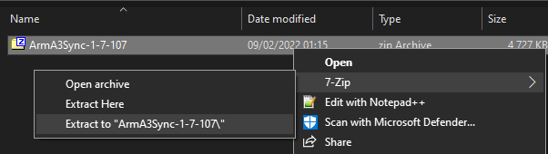
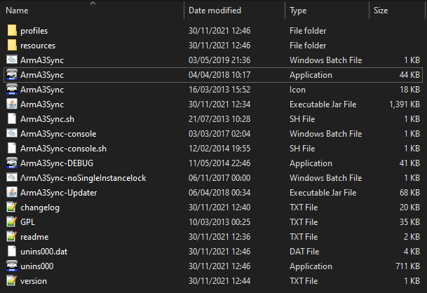

<!---
Explain what repos are and how they work
- Explain that we use ArmA3Sync for the above
- Invite users to first page
-->

# Getting started

::: tip Necessary download
If you don’t have it already, you will need [Java Runtime Environment 8](https://www.java.com/en/download/) or higher to use
ArmA3Sync.
:::

## Download ArmA3Sync.zip

You can download ArmA3Sync [here](https://www.dropbox.com/sh/0vkt7x25xahw4cd/AACHSjIijmWsI6C_Si5hVXyoa?dl=0).
Extract the contents somewhere where they’re easy to access and ideally create a shortcut on your desktop that points to ArmA3Sync.

After extracting
the compressed folder, run **ArmA3Sync.exe**.

## Installation (optional)

If someone sent you the ArmA3Sync installer instead of a ZIP archive, run the
installer and follow the instructions to complete the installation process. It doesn’t
matter where you install ArmA3Sync, as long as you know where to find it or have
a shortcut to the application.

1. Extract the contents of the ZIP archive to a new folder.

2. Run **ArmA3Sync.exe**.

