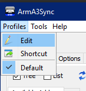
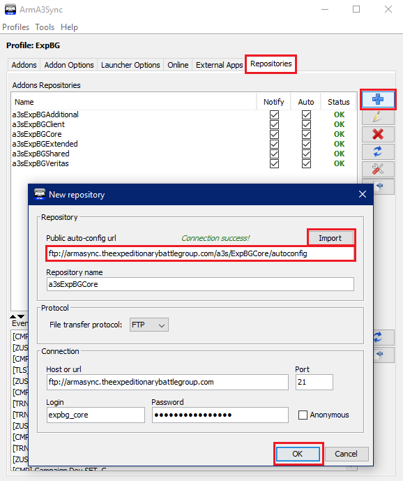
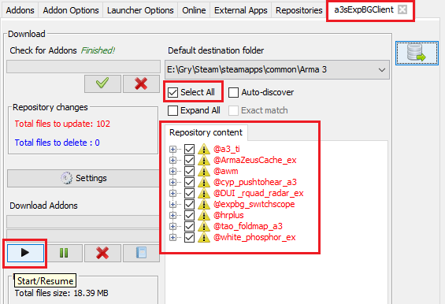
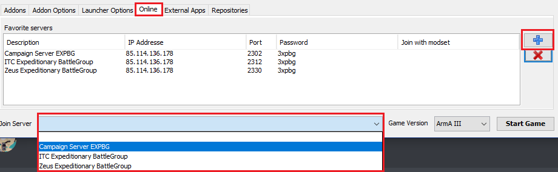

- Explain what repos are and how they work
- Explain that we use ArmA3Sync for the above
- Invite users to first page

# Getting started

::: tip Necessary download
If you don’t have it already, you will need [Java Runtime Environment 8](https://www.java.com/en/download/) or higher to use
ArmA3Sync.
:::

## Download ArmA3Sync.zip

You can download ArmA3Sync [here](https://www.dropbox.com/sh/0vkt7x25xahw4cd/AACHSjIijmWsI6C_Si5hVXyoa?dl=0).
Extract the contents somewhere where they’re easy to access and ideally create a shortcut on your desktop that points to ArmA3Sync.

After extracting
the compressed folder, run **ArmA3Sync.exe**.

## Installation (optional)

If someone sent you the ArmA3Sync installer instead of a ZIP archive, run the
installer and follow the instructions to complete the installation process. It doesn’t
matter where you install ArmA3Sync, as long as you know where to find it or have
a shortcut to the application.

1. Extract the contents of the ZIP archive to a new folder.

2. Run **ArmA3Sync.exe**.

## Configuration

### Create a new profile

If prompted, enter the location of your Arma 3 root directory in your Steam folder.

Otherwise, follow these instructions:

1. Click **Profiles**, go to **Edit**.

1. Select **New**, enter a profile name (e.g. ExpBG) and click **OK**.

3. Make sure your new profile is selected before clicking **OK** to exit this window.

### Arma 3 Mod Location

In this step, you will tell ArmA3Sync to store all your ExpBG mods in the same directory as your root ArmA3 folder.

Go to the **Addon Options** tab, locate your Arma 3 directory in your Steam folder and click **Open**.

### Add a new repository

To add a new repository, follow the steps below:

In the **Repositories** tab, click the **blue plus** button near the top-right corner. A **New repository** pop-up window will appear:

To gain access to ExpBG mods, you will have to add a few repositories first and connect to them. For ease of use, there are two sets of repositories:

- One set contains ITC training sessions and client-side mods
- The other set contains all the remaining content, such as maps and assets used during our missions and campaigns.

**ITC Training repository set**:

- ftp://armasync.theexpeditionarybattlegroup.com/a3s/ExpBGCore/autoconfig
- ftp://armasync.theexpeditionarybattlegroup.com/a3s/ExpBGClient/autoconfig

Copy the first repository link and paste it in the **Public auto-config url** field, then click **Import**. The rest of the fields will be automatically populated. When that happens, click **OK**.

[gif]

::: tip Optional repository
While you only need the **ExpBGCore** repository to complete ITC-1 training, we highly
suggest you also download the **ExpBGClient** repository for quality-of-life improvements.
:::

To prevent delays, we recommend downloading the rest of the mods from the remaining repositories only after you've completed training.

**Remaining ExpBG repositories**:

- ftp://armasync.theexpeditionarybattlegroup.com/a3s/ExpBGExtended/autoconfig
- ftp://armasync.theexpeditionarybattlegroup.com/a3s/ExpBGAdditional/autoconfig
- ftp://armasync.theexpeditionarybattlegroup.com/a3s/ExpBGShared/autoconfig

### Configure and connect to your repositories

Now we just need to connect to the remote repositories you've added and download your mods.

Follow these instructions:

1. Still in the **Repositories** tab, tick all the **Notify** and **Auto** boxes, then click the **Connect to Repository** icon.

2. The contents of the repository you connected to will open in a new tab. Once the check for addons in the top-left corner finishes, tick the **Select All** box, then click the **Start/Resume** button towards the left.

::: warning Mismatch error
Make sure you tick all of the file names in the **Repository content** tab in your repository. If you don't do this, there is a high chance that you won't download all the mods that the server requires. This will result in a "mismatch error", preventing you from joining the server until you fix the issue.
:::

Use the instructions on the previous page to add the remaining repositories to ArmA3Sync.

Be aware that by downloading all the mods from all the repositories will take a long time regardless of your Internet speed.

### Add and select the modsets you want to use

In the **Addons** tab, click the **Modsets** button with a blue plus icon next to it.

ITC training only requires you to tick the fields from the list of events as selected above, but you can tick all the boxes if you wish.

If you won't be Zeusing any time soon, ignore Zeus tools.

You should see your added modsets in **Addon Groups**. Only tick the modsets needed for the mission you want to join.

You've now added a group of pre-defined mods called a "modset" that you can choose from. These modsets will automatically be updated regularly. The above configuration shows what you need to enable in order to join an ITC-1 server with client-side mods enabled.

If you can't join the server due to outdated mods, try restarting ArmA3Sync. That usally works straight away. If not, go to the **Addons** tab, right-click the modsets in **Addon Groups**, remove them and then repeat the steps in this section from the beginning.

::: tip Removing modsets
Removing modsets in **Addon Groups** only removes them from the list of mods that you can load. It doesn't delete/uninstall any mods, so don't worry, you won't have to redownload anything.
:::

::: warning Incorrect mods loaded
Be aware that you may be unable to join the server if one of these situations occur:

- You load fewer mods than the server requires
- You load more mods than the server expects

Only select the necessary mods being used for any given mission. Ask the guys on TS or Discord as to which modset is being used and only load that.

This does not apply to the client-side modset that can be run on nearly every mission.
:::

### Launcher options

Now let's set up ArmA3Sync to allow Arma 3 to make better use of your computer hardware.

You can use parts of this example setup for your own configuration. This is based on a Ryzen 5 5600X. For faster loading times, manually type `-skipintro` into **Additional Parameters**.

If your ArmA III Executable Location is empty, locate your **arma3_x64.exe** and click **Select**.

::: warning Things to avoid
Do not tick **No File Patching**, **Check Signatures** or **Auto-restart**. These will either extend your mission loading time significantly, make bugfixing harder if anything goes wrong, or prevent you from joining altogether.
:::

You can visit [this wiki page](https://community.bistudio.com/wiki/Arma_3:_Custom_Memory_Allocator) for more information about Malloc (custom memory allocators).

Remember that you can always ask around on the `#💻general-tech-support` channel on Discord if you need extra help.

### Selecting your mods

Simply select all the modsets that you need for a given mission. If you are told not to load a specific mod, expand the drop-down menu and untick that particular mod.

Here is an example showing what modsets you need to select to play Saturday missions:

### Joining a server

Go to the **Online** tab and paste the following parameters into the **Favorite servers** table by clicking the **Blue Plus** on the right:

Once you have done this, you'll be able to select the server from the **Join Server** drop-down menu at the bottom.

| Description                    | IP Address     | Port | Password |
| ------------------------------ | -------------- | ---- | -------- |
| Campaign Server EXPBG          | 85.114.136.178 | 2302 | 3xpbg    |
| ITC Expeditionary BattleGroup  | 85.114.136.178 | 2312 | 3xpbg    |
| Zeus Expeditionary BattleGroup | 85.114.136.178 | 2330 | 3xpbg    |

Alternatively, you can click **Start Game** at the bottom right without selecting a server from the list and join using the Arma 3 server browser or by joining a friend via Steam.

### Server credentials

When prompted, enter the following to join the server:

**Username**: expbg
**Password**: 3xpbg