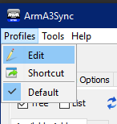
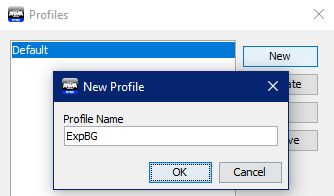
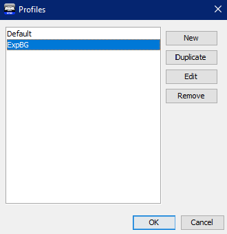
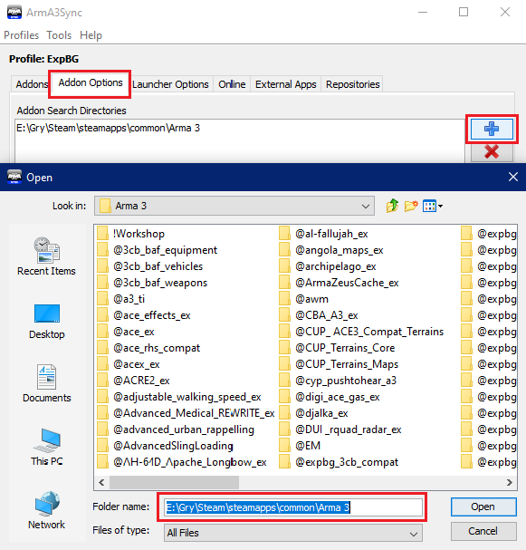
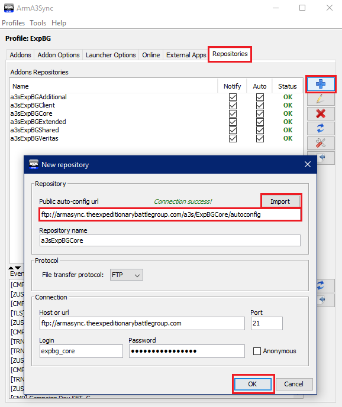
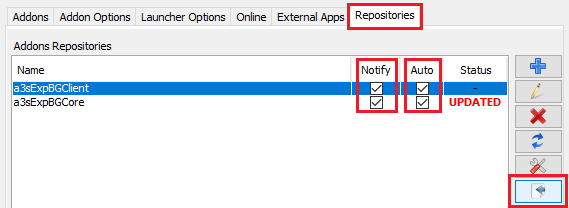
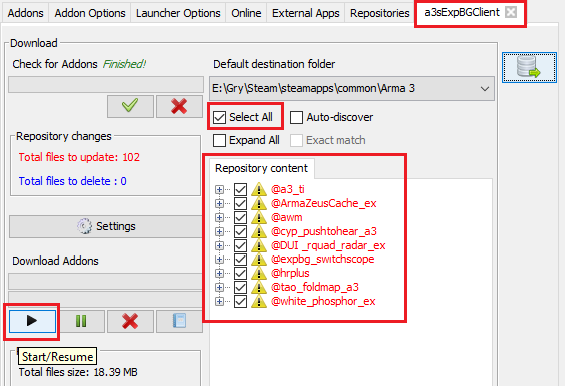

# Configuration

## Create a new profile

If prompted, enter the location of your Arma 3 root directory in your Steam folder.

Otherwise, follow these instructions:

1. Click **Profiles**, go to **Edit**.

2. Select **New**, enter a profile name (e.g. ExpBG) and click **OK**.

3. Make sure your new profile is selected before clicking **OK** to exit this window.

## Set Arma 3 mod location

In this step, you will tell ArmA3Sync to store all your ExpBG mods in the same directory as your root ArmA3 folder.

Go to the **Addon Options** tab, locate your Arma 3 directory in your Steam folder and click **Open**.

## Add a remote repository

To add a new repository, follow the steps below:

In the **Repositories** tab, click the **blue plus** button near the top-right corner. A **New repository** pop-up window will appear:

To gain access to ExpBG mods, you will have to add a few repositories first and connect to them. For ease of use, there are two sets of repositories:

- One set contains ITC training sessions and client-side mods
- The other set contains all the remaining content, such as maps and assets used during our missions and campaigns.

**ITC Training repository set**:

| Repo Name    | Repo Link                                                                 |
| ------------ | ------------------------------------------------------------------------- |
| ExpBG Core   | ftp://armasync.theexpeditionarybattlegroup.com/a3s/ExpBGCore/autoconfig   |
| ExpBG Client | ftp://armasync.theexpeditionarybattlegroup.com/a3s/ExpBGClient/autoconfig |

Copy the first repository link and paste it in the **Public auto-config url** field, then click **Import**. The rest of the fields will be automatically populated. When that happens, click **OK**.

<!-- GIF -->

::: tip Optional repository
While you only need the **ExpBGCore** repository to complete ITC-1 training, we highly
suggest you also download the **ExpBGClient** repository for quality-of-life improvements.
:::

To prevent delays, we recommend downloading the rest of the mods from the remaining repositories only after you've completed training.

**Remaining ExpBG repositories**:

| Repo Name        | Repo Link                                                                     |
| ---------------- | ----------------------------------------------------------------------------- |
| ExpBG Extended   | ftp://armasync.theexpeditionarybattlegroup.com/a3s/ExpBGExtended/autoconfig   |
| ExpBG Additional | ftp://armasync.theexpeditionarybattlegroup.com/a3s/ExpBGAdditional/autoconfig |
| ExpBG Shared     | ftp://armasync.theexpeditionarybattlegroup.com/a3s/ExpBGShared/autoconfig     |

Check out the [Repo List](../repos/README.md) page for more information about these repositories.

## Configure and connect to your repositories

Now we just need to connect to the remote repositories you've added and download your mods.

Follow these instructions:

1. Still in the **Repositories** tab, tick all the **Notify** and **Auto** boxes, then click the **Connect to Repository** icon.

2. The contents of the repository you connected to will open in a new tab. Once the check for addons in the top-left corner finishes, tick the **Select All** box, then click the **Start/Resume** button towards the left.

::: warning Mismatch error
Make sure you tick all of the file names in the **Repository content** tab in your repository. If you don't do this, there is a high chance that you won't download all the mods that the server requires. This will result in a "mismatch error", preventing you from joining the server until you fix the issue.
:::

Use the instructions on the previous page to add the remaining repositories to ArmA3Sync.

Be aware that by downloading all the mods from all the repositories will take a long time regardless of your Internet speed.