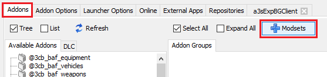
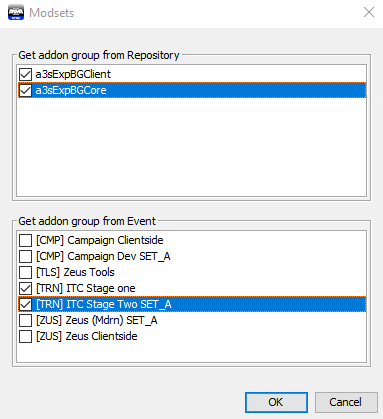
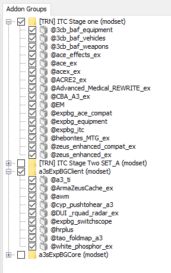
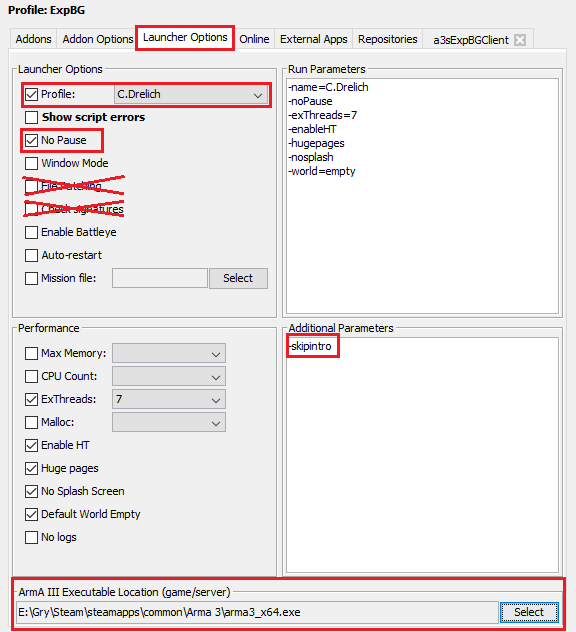
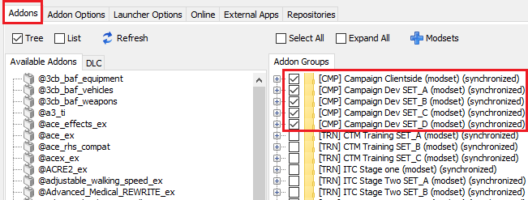
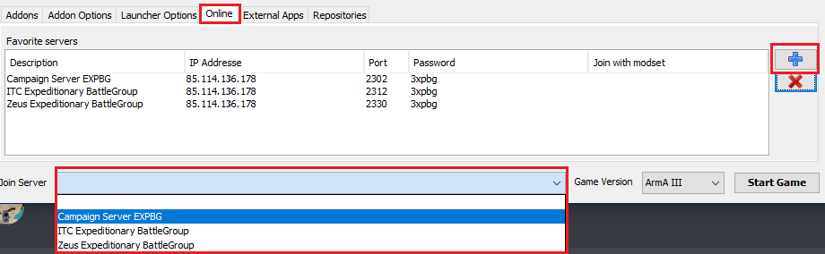

# Daily use

## Add and select the modsets you want to use

In the **Addons** tab, click the **Modsets** button with a blue plus icon next to it.

ITC training only requires you to tick the fields from the list of events as selected above, but you can tick all the boxes if you wish.

If you won't be Zeusing any time soon, ignore Zeus tools.

You should see your added modsets in **Addon Groups**. Only tick the modsets needed for the mission you want to join.

You've now added a group of pre-defined mods called a "modset" that you can choose from. These modsets will automatically be updated regularly. The above configuration shows what you need to enable in order to join an ITC-1 server with client-side mods enabled.

If you can't join the server due to outdated mods, try restarting ArmA3Sync. That usally works straight away. If not, go to the **Addons** tab, right-click the modsets in **Addon Groups**, remove them and then repeat the steps in this section from the beginning.

::: tip Removing modsets
Removing modsets in **Addon Groups** only removes them from the list of mods that you can load. It doesn't delete/uninstall any mods, so don't worry, you won't have to redownload anything.
:::

::: warning Incorrect mods loaded
Be aware that you may be unable to join the server if one of these situations occur:

- You load fewer mods than the server requires
- You load more mods than the server expects

Only select the necessary mods being used for any given mission. Ask the guys on TS or Discord as to which modset is being used and only load that.

This does not apply to the client-side modset that can be run on nearly every mission.
:::

## Launcher options

Now let's set up ArmA3Sync to allow Arma 3 to make better use of your computer hardware.

You can use parts of this example setup for your own configuration. This is based on a Ryzen 5 5600X. For faster loading times, manually type `-skipintro` into **Additional Parameters**.

If your ArmA III Executable Location is empty, locate your **arma3_x64.exe** and click **Select**.

::: warning Things to avoid
Do not tick **No File Patching**, **Check Signatures** or **Auto-restart**. These will either extend your mission loading time significantly, make bugfixing harder if anything goes wrong, or prevent you from joining altogether.
:::

You can visit [this wiki page](https://community.bistudio.com/wiki/Arma_3:_Custom_Memory_Allocator) for more information about Malloc (custom memory allocators).

Remember that you can always ask around on the `#💻general-tech-support` channel on Discord if you need extra help.

## Select the mods you want to use

Simply select all the modsets that you need for a given mission. If you are told not to load a specific mod, expand the drop-down menu and untick that particular mod.

Here is an example showing what modsets you need to select to play Saturday missions:

## Join a server

Go to the **Online** tab and paste the following parameters into the **Favorite servers** table by clicking the **Blue Plus** on the right:

Once you have done this, you'll be able to select the server from the **Join Server** drop-down menu at the bottom.

| Description                    | IP Address     | Port | Password |
| ------------------------------ | -------------- | ---- | -------- |
| Campaign Server EXPBG          | 85.114.136.178 | 2302 | 3xpbg    |
| ITC Expeditionary BattleGroup  | 85.114.136.178 | 2312 | 3xpbg    |
| Zeus Expeditionary BattleGroup | 85.114.136.178 | 2330 | 3xpbg    |

Alternatively, you can click **Start Game** at the bottom right without selecting a server from the list and join using the Arma 3 server browser or by joining a friend via Steam.

### Server credentials

When prompted, enter the following to join the server:

**Username**: expbg 
**Password**: 3xpbg