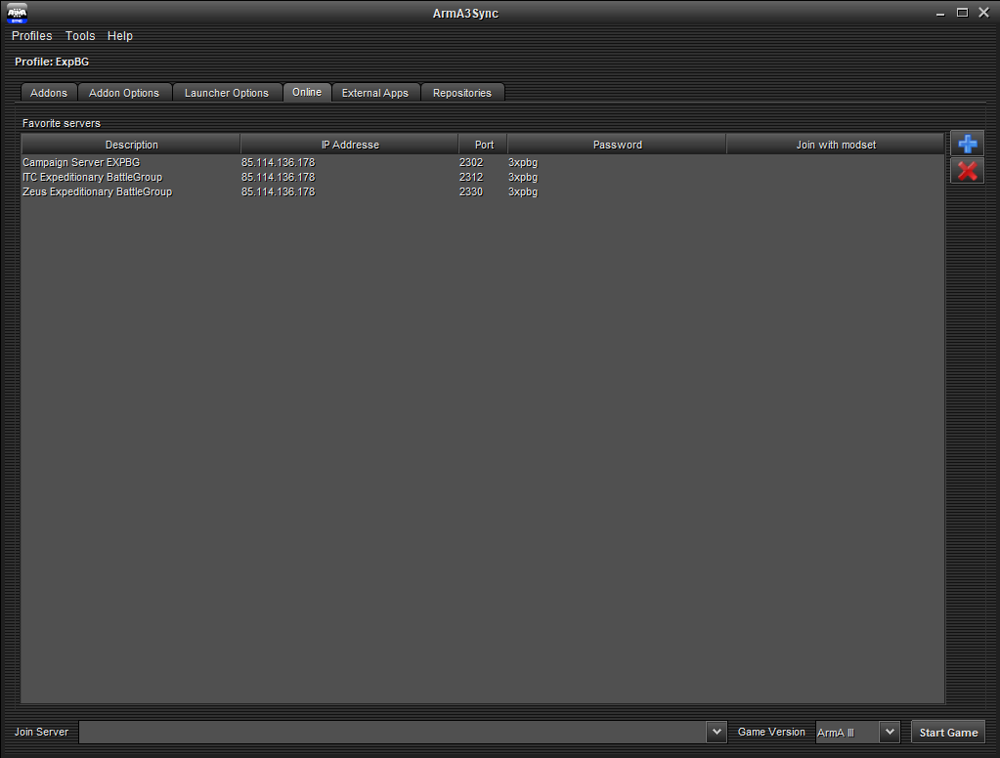

# Servers

## Join a server

Despite using the same IP address, ExpBG servers use different ports. This is so that multiple instances of servers can be run at the same time (e.g., one guy wants to build a mission as Zeus while there is a training mission going on at the same time.)

There are multiple two ways to join an ExpBG server:
- Through a friend on Steam
- Finding the server on the Arma 3 server list (not recommended)
- Manually by entering the IP address

For example, if it's 19:00 UTC on a Saturday and you are joining a campaign mission, you need to connect to **Campaign Server EXPBG**.

| Description                    | IP Address     | Port | Password |
| ------------------------------ | -------------- | ---- | -------- |
| Campaign Server EXPBG          | 85.114.136.178 | 2302 | 3xpbg    |
| ITC Expeditionary BattleGroup  | 85.114.136.178 | 2312 | 3xpbg    |
| Zeus Expeditionary BattleGroup | 85.114.136.178 | 2330 | 3xpbg    |

::: tip ArmA3Sync list
Adding these servers to the **Online** tab in ArmA3Sync will allow you to join a server directly by selecting one from the **Join Server** drop-down menu at the bottom of the application.

:::

## Server credentials

ExpBG servers are password protected. After attempting to join any of the servers listed in the table above, enter the credentials below to connect:

<table>
    <tr>
        <th>Username</th>
        <td>expbg</td>
    </tr>
    <tr>
        <th>Password</th>
        <td>3xpbg</td>
    </tr>
</table>